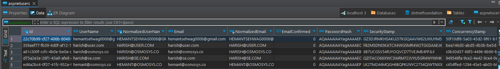
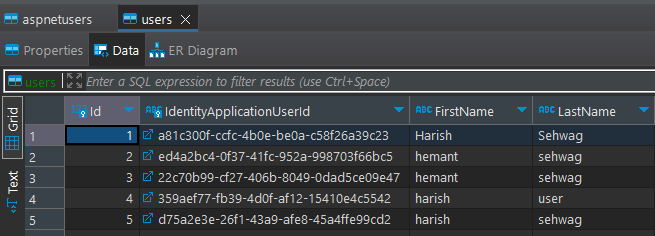
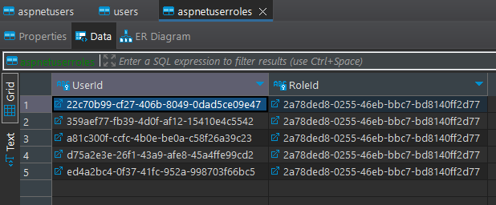
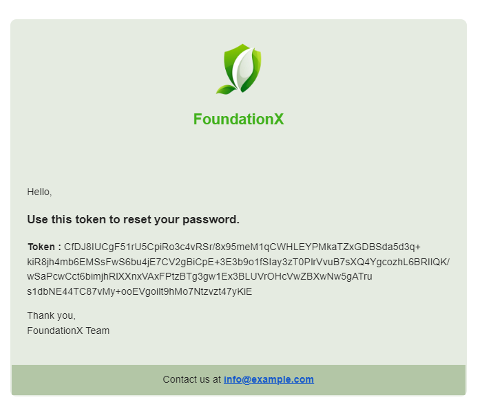

# API Documentation

This document provides a brief overview of the different API endpoints, their usage and purpose.

## Authentication

This section lists the authentication related requests such as login.

### Login

Allows the user to login into the portal and receive the auth token from the API. Requires the user email and password values.

#### User Login Flow

Here is a step-by-step breakdown of the user login flow:

1. **Client-Side Request**

   The client sends a login request to the server.

2. **AuthenticationController Handling**

   The `AuthenticationController` captures the login request through the `POST /login` endpoint.

3. **Service Delegation**

   The `AuthenticationController` delegates the login process to the `AuthenticationService`.

4. **AuthenticationService Processing**

   The `AuthenticationService` is responsible for processing the login request. It interacts with the `UserRepository` to verify user credentials.

5. **UserRepository Database Interaction**

   The `UserRepository` interacts with the database to:

   - Utilize `PasswordSignInAsync` function for password validation provided by `SignInManager` component of Asp.Net Identity.
   - Retrieve user details using `UserManager` function's provided by Asp.Net Identity.

6. **JWT Token Generation**

   Upon successful login, the `AuthenticationService` generates a JWT token using user information.

7. **Response to Client**

   The `AuthenticationController` responds to the client with the generated JWT token.

The user login flow involves the client sending a login request, which is handled by the `AuthenticationController`. The controller delegates the login process to the `AuthenticationService`, and the user credentials are verified by interacting with the `UserRepository`. If successful, a JWT token is generated and sent back to the client. This flow ensures a secure and structured user login process, utilizing key components provided by ASP.NET Identity and Entity Framework.

#### Database Table Involved

Asp.Net User Table


User Table



#### API details

**Endpoint:** `http://localhost:5000/api/auth/register`

**Method:** `POST`

**Body:**

```json
{
  "email": "example@gmail.com",
  "password": "Change@123"
}
```

**cURL**

```sh
curl -X 'POST' \
  'http://localhost:5000/api/auth/login' \
  -H 'accept: */*' \
  -H 'Content-Type: application/json' \
  -d '{
  "email": "example@gmail.com",
  "password": "Change@123"
}'
```

**Sample response**

```json
{
  "token": "<AUTH_TOKEN>"
}
```

### Register

Allows the new user to register into the portal and receive the auth token from the API. Requires the user details (firstname,lastname,email) and password values.

#### User Registration Flow

Here is a step-by-step breakdown of the user registration flow:

1. **Client-Side Request**

   The client sends a registration request to the server.

2. **AuthenticationController Handling**

   The `AuthenticationController` captures the registration request through the `POST /register` endpoint.

3. **Service Delegation**

   The `AuthenticationController` delegates the registration process to the `AuthenticationService`.

4. **AuthenticationService Processing**

   - The `AuthenticationService` is responsible for processing the registration request.It interacts with the `UserRepository` to handle user-related database operations.

5. **UserRepository Database Interaction**

   The `UserRepository` interacts with the database to:

   - Create a new `IdentityApplicationUser` (an identity entity).
   - Use `CreateAsync` method of `UserManager` Component to create a new identity user
   - Add user details to the `ApplicationUser` entity.
   - Associate user roles.
   - Commit the changes to the database within a transaction.

6. **JWT Token Generation**

   Upon successful registration, the `AuthenticationService` generates a JWT token using user information.

7. **Response to Client**

   The `AuthenticationController` responds to the client with the generated JWT token.

The overall flow ensures a secure and structured user registration process using key components provided by ASP.NET, including Identity for user management and Entity Framework for database interactions. The separation of concerns among the controller, service, and repository ensures maintainability and scalability of the authentication process.

#### Database Table Involved

Asp.Net User Table


User Table


User Role



#### API details

**Endpoint:** `http://localhost:5000/api/auth/register`

**Method:** `POST`

**Body:**

```json
{
  "firstName": "firstname",
  "lastName": "lastname",
  "email": "example@gmail.com",
  "password": "Change@123"
}
```

**cURL**

```sh
curl -X 'POST' \
  'http://localhost:5000/api/auth/register' \
  -H 'accept: */*' \
  -H 'Content-Type: application/json' \
  -d '{
  "firstName": "firstname",
  "lastName": "lastname",
  "email": "example@gmail.com",
  "password": "Change@123"
}'
```

**Sample response**

```json
{
  "token": "<AUTH_TOKEN>"
}
```

### Forget Password

Allows the user to send forget password request to the portal and receive the reset token that is used to change the password from the API. Requires the user email.

#### Forgot Password Flow

Here is a step-by-step breakdown of the forgot password flow:

1. **Client-Side Request**

   The client sends a forgot password request to the server.

2. **AuthenticationController Handling**

   The `AuthenticationController` captures the forgot password request through the `POST /forgot-password` endpoint.

3. **Service Delegation**

   The `AuthenticationController` delegates the forgot password process to the `AuthenticationService`.

4. **AuthenticationService Processing**

   The `AuthenticationService` is responsible for initiating the forgot password process.It interacts with the `UserRepository` to find the user by email.

5. **UserRepository Database Interaction**

   The `UserRepository` interacts with the database (Entity Framework) to:

   - Use `UserManager.FindByEmailAsync` to find a user by email.
   - Generate a password reset token using `GeneratePasswordResetTokenAsync` provided by `UserManager` Component of Asp.Net Identity.

6. **Email Notification**

   The password reset token is sent to the user's email.The `SendForgetPasswordEmailAsync` funciton of `IEmailRepository` is used for sending the email via `osmo-x`.

7. **Response to Client**

   The `AuthenticationController` responds to the client with a message indicating that the password reset process has been initiated.

The forgot password flow involves the client initiating a request, which is handled by the `AuthenticationController`. The controller delegates the process to the `AuthenticationService`, and the necessary steps are taken in the `UserRepository`. A password reset token is generated, sent to the user's email for verification, and a response is provided to the client. This ensures a secure and structured forgot password process using ASP.NET Identity and Entity Framework components.

#### Database Table Involved

Asp.Net User Table


#### API details

**Endpoint:** `http://localhost:5000/api/auth/forgot-password`

**Method:** `POST`

**QueryParam:**

```
email = example@gmail.com
```

**cURL**

```sh
curl -X 'POST' \
  'http://localhost:5000/api/auth/forgot-password?email=example%40gmail.com' \
  -H 'accept: */*' \
  -d ''
```

**Sample response**

```json
200: Success
```

**Sample Mail**



### Reset Password

Allows the user to change the password for portal login. Requires reset token, user email and new password value.

#### Reset Password Flow

Here is a step-by-step breakdown of the reset password flow:

1. **Client-Side Request**

   The client sends a reset password request to the server.

2. **AuthenticationController Handling**

   The `AuthenticationController` captures the reset password request through the `POST /reset-password` endpoint.

3. **Service Delegation:**

   The `AuthenticationController` delegates the reset password process to the `AuthenticationService`.

4. **AuthenticationService Processing**

   The `AuthenticationService` is responsible for processing the reset password request.It interacts with the `UserRepository` to reset the user's password.

5. **UserRepository Database Interaction**

   The `UserRepository` interacts with the database (Entity Framework) to:
   - Use `UserManager<IdentityApplicationUser>` to find the user by email.
   - Reset the user's password using `ResetPasswordAsync` function provided by UserManger of Asp.Net Identity.

6. **JWT Token Generation**

   Upon successful password reset, the `AuthenticationService` generates a new JWT token using user information.

7. **Response to Client**

   The `AuthenticationController` responds to the client with the generated JWT token.

The reset password flow involves the client initiating a request, which is handled by the `AuthenticationController`. The controller delegates the process to the `AuthenticationService`, and the necessary steps are taken in the `UserRepository`. Upon successful password reset, a new JWT token is generated and sent to the client. This ensures a secure and structured reset password process using ASP.NET Identity and Entity Framework components.

#### Database Table Involved

Asp .Net User


#### API details

**Endpoint:** `http://localhost:5000/api/auth/reset-password`

**Method:** `POST`

**Body:**

```json
{
  "email": "example@gmail.com",
  "token": "<RESET_TOKEN>",
  "password": "Change@123"
}
```

**cURL**

```sh
curl -X 'POST' \
  'http://localhost:5000/api/auth/reset-password' \
  -H 'accept: */*' \
  -H 'Content-Type: application/json' \
  -d '{
  "email": "example@gmail.com",
  "token":"<RESET_TOKEN>",
  "password": "Change@123"
}'
```

**Sample response**

```json
{
  "token": "<AUTH_TOKEN>"
}
```
