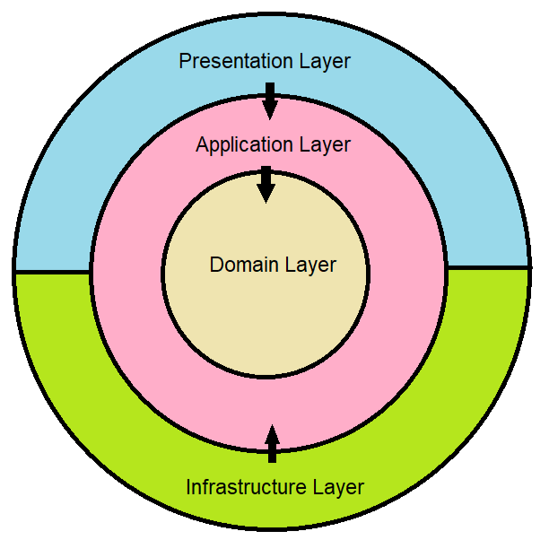
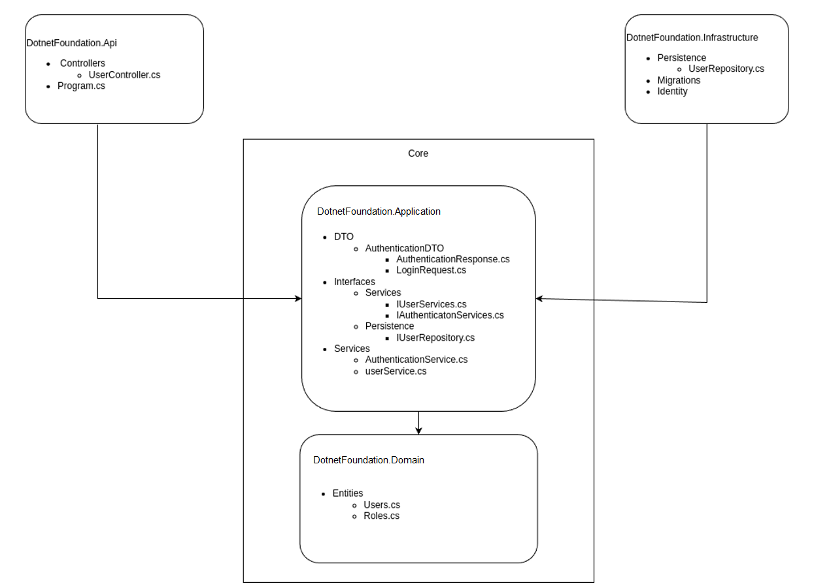

# Clean Architecture

## Introduction

Clean Architecture is a software design philosophy that prioritizes the separation of concerns, making systems more modular, adaptable, and testable. It advocates for a clear distinction between business rules, application logic, and infrastructure details.

- The primary objective of clean architecture is to ensure that the code/logic remains resistant to change.
- It means that core of the system should be written without direct dependencies.
- So that any future alterations to the development framework or User Interface (UI) can be implemented without modifying the core.
- This means that outer modules depend on the inner core
- It also means that our external dependencies are completely replaceable.

## Architecture Components and Layers

Clean architecture philosophy is that innermost core is independent and surrounding outer layers are depending on inner layers.

Fig. 1: Clean Architecture Diagram

It is divided into the following parts, going from the innermost layer to the outer parts.

**Core Components**

#### 1. The Domain Layer (Inner Core)

- This layer contains definition of all the objects which represent the business model.
- It also contains the business rules, validations, and domain-specific logic.
- As the innermost layer, it remains independent of infrastructure details.

#### 2. The Application Layer (Outer Core)

- This layer manages application specific business logic and application-specific rules.
- All the application "features" are kept here. It is also responsible for calling all the domain objects and methods.
  - It consists of Data Transfer Objects (DTOs), interfaces, and services.
  - Interfaces define contracts for interacting with the domain and infrastructure layers.
  - Services implement application logic, ensuring separation from infrastructure concerns.

**Components outside the Core**

#### 3. The Infrastrusture Layer

- Infrastructure layer contains the data access logic. It is responsible for modules pertaining to data storage, external integrations, and identity.
- UserRepository serves as the bridge between the application and the data storage mechanism.
- It includes Identity Models, extending the ASP.NET Identity framework.
- It is also used to configure dependency injection for infrastructure services.

#### 4. The Presentation (API) Layer

- This layer is responsible for containing modules which facilitate interaction with the user.
- It is responsible for handling HTTP requests.
- It follows the RESTful API design principles.
- It contains controllers for user management, authentication, and authorization.

> Clean architecture pattern puts the focus on domain (inner circle) and contains various logical components that have well defined interactions with one another.

Fig. 2: Components in DotnetFoundation with Clean Architecture

## Advantages of Clean Architecture

**Improved Maintainability**

- By separating the codebase in various logical components and enforcing the dependency rules between them, it becomes much easier to understand and modify the code.
- Abstractions allow you to design your business logic in a flexible way, without having to know the implementation details.

**Modularity and Separation of Concerns**

- Each layer has a specific purpose and is decoupled from the others, making it easier to understand and modify individual components without affecting the rest of the system.
- The modular design enables the user to extend the code easily.
- This modularity also makes it easier to reuse components in other projects.

**Testability**

- As clean architecture poromtes clear seperation of concerns, it facilitates unit testing for individual components
- Clean architecture also makes it easier to test and debug the code.
- The business logic can be extensively tested as the inner core is independent of the architecture of outer layers.

**Scalability**

- The architecture is adaptable to evolving project requirements and scalable for future feature enhancements.
- New features, upgrades, replacements or changes can be introduced without major disruptions to the existing system.

**Increased Flexibility**

- Independence from specific frameworks or technologies allows flexibility in choosing the most suitable tools for each layer.
- Dividing the concerns of different components simplifies updating the code to meet changing requirements.

## Conclusion

Clean Architecture is designed to prioritize maintainability, flexibility, and scalability by enforcing a clear separation between the core business logic and external dependencies, such as frameworks, databases, and user interfaces. It promotes the use of well-defined boundaries between these layers, with each layer having a specific responsibility and the ability to evolve independently. Clean Architecture aims to create systems that are easy to understand, test, and modify over time.

For more information please check the official **Microsoft Documentation** on [Clean Architecture](https://learn.microsoft.com/en-us/dotnet/architecture/modern-web-apps-azure/common-web-application-architectures#clean-architecture)
